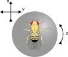

# Data structure

Leg kinematics data is stored in an HDF5 file and can be loaded with the `data_loader.load_data_hdf` function (see example notebooks),
which returns dictionary mapping genotype names to pandas dataframes.
Each row in the dataframe is single frame recorded at 200 Hz.
Each dataframe can contain multiple trials from multiple recording sessions.

|colunmn name|desciption|
|---|---|
|`flynum: int`|integer specifying specimen, 1-based|
|`trial: int`|integer specifying trial number, 1-based|
|`fnum: int`|integer specifying frame number, 0-based, resets for each `flynum` but not `tnum` (see below)|
|`SF: int`|stimulation frequency in given `tnum`, Hz|
|e.g. `R-F-ThC_x: float`|x coordinate of thorax-coxa joint in right front leg, a.u. (see below)|
|e.g. `R-WH_x: float`|x coordinate of right wing hinge, a.u. (see below)|
|e.g. `Notum_x: float`|x coordinate of the notum, a.u. (see below)|
|e.g. `L1A_abduct: float` | abduction angle at the thorax-coxa joint of the Left front leg, degrees (see below) | 
|e.g. `x_pos: float` | x ball position at each frame (see below) | 
|e.g. `x_vel: float` | x ball velocity at each frame (see below) |
|e.g. `R-F_stepcycle: bool` | indicating if right front leg is touching the surface (`True`) or not (`False`)|

Note that each trial is 1400 frames, 600-1000 are optically stimulated.

The naming convention for columns positions is as follows:
- leg
    - `R`: right or `L`: left side
    - `F`: front `M`: mid `H`: hind leg|
- joint or point
    - `ThC`: thorax-coxa,
    - `CTr`: coxa-trochanter
    - `TiTa`: tibia-tarsus
    - `TaG`: tarsus-ground
    - `WH`: wing hinge
    - `Notum`: notum
- axis 
    - `x`, `y`, `z` coordinates of joint
    - `r` distance from center of ball (only available after ball fitting)

The naming convention for the angles is as follows:
- leg
    - `R`: right or `L`: left side
    - `1`: Front leg or `2` : Mid  leg or `3` : Hind leg
- joint
    - `A`: Thorax-Coxa joint
    - `B`: Coxa-Trocanter joint
    - `C`: Femur-Tibia joint
    - `D`: Tibia-Tarsus joint
- angle
    - `abduct`: abduction
    - `flex`: flexion
    - `rot`: rotation

 - Degrees of Freedom for tracked points
    - Wing hinges (count =2) , notum (count =1)  and all thorax coxa points (count = 6) are all 'fixed points' with little jitter 
    - All the 4 joints on the leg are assumed to be moving with limited degrees of freedom (DoF). For example, for the left front leg:
        - Thorax-Coxa joint (L1A): abduction, flexion and rotation
        - Coxa-Trocanter (L1B) : flexion and rotation
        - Femur-Tibia (L1C): flexion and rotation
        - Tibia-Tarsus (L1D) : flexion only
    - For the Thorax-Coxa joints one of the 3 points defining each DoF is a point on the body of the fly. Definitions are as follows for the left front leg:
        - `abduction` : L-WH -> L-F-ThC -> L-F-CTr
        - `flexion` : Notum -> L-F-ThC -> L-F-CTr
        - `rotation`: L-F-ThC-> L-F-CTr->L-F-FeTi  (defined as the roation of the line segment defined by the latter two points around the axis defined by the first two points)

Important: The coordinate system for the points on the fly body is different than the coordinate system for the ball movement.

The ball tracker reports ball movement along the following directions:

